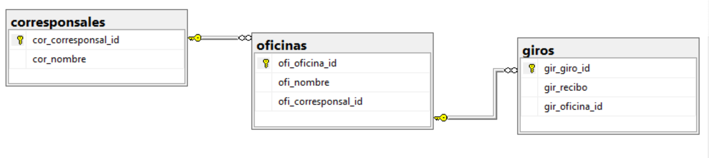

# <b>Información general de la base de datos</b>

<b>Base de datos dbcontrolbox </b> 

Por medio de esta base de datos se conocerá el nombre de los corresponsales y de las oficinas que cada uno de estos tenga asociado, al igual que los giros que se realicen en cada una de las oficinas. 

<b>Tablas: </b> corresponsales, oficinas y giros.

- Corresponsales: cor_corresponsal_id int primary key - cor_nombre varchar(80)
- Oficinas: ofi_oficina_id int primary key - ofi_nombre varchar(80) - ofi_corresponsal_id int foreign key
- Giros: gir_giro_id int primary key - gir_recibo int - gir_oficina_id int foreign key

<b>Relaciones</b>

# <b>Modelo relacional</b>

# <b>Importación de la base de datos</b>
1. Ingresar a SQL Server Management. 
2. Abrir el archivo SQLControlBox.sql.
3. Y dar en la opción "Execute".

De esta manera la base de datos en su dispositivo.